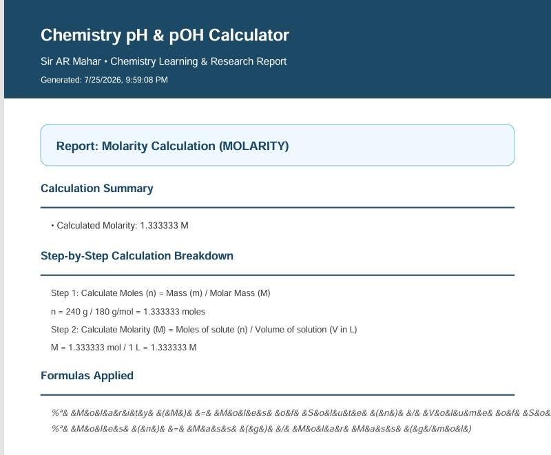

# 🧪 Chemistry pH & pOH Calculator Suite

[](https://p-h-calculator-ar-mahar.vercel.app/)
[](https://react.dev/)
[](https://www.typescriptlang.org/)
[](https://ai.google.dev/)

A modern, interactive, and comprehensive web application for chemistry students, educators, and lab researchers. Created by **Sir AR Mahar**, this suite provides accurate solution calculations, stoichiometry solvers, an interactive periodic table reference, and an intelligent **AI Chemistry Tutor** powered by Google's **Gemini 2.5 Flash** model
.chemistry Lab is a complete chemistry calculation and tutoring tool built for students and teachers who need fast, accurate acid-base chemistry calculations along with real explanations — not just answers. Many students struggle with pH, pOH, molarity, molality, and dilution problems because they don't have access to a reliable calculator or a tutor available whenever they get stuck. This app solves that by combining: A full suite of accurate chemistry calculators Step-by-step, easy-to-follow solutions An AI chemistry tutor available anytime to explain concepts in simple language Built for students and teachers at GH1-047 Govt. Higher Secondary School, Ali Mahar, District Ghotki, Sindh, and for any student learning acid-base chemistry.

🌐 **Live Application:** [https://p-h-calculator-ar-mahar.vercel.app/](https://p-h-calculator-ar-mahar.vercel.app/)

---

## 📸 Screenshots & Application Preview

### 1. pH & pOH Calculator Dashboard
Calculate pH, pOH, $[H^+]$, and $[OH^-]$ concentrations with explicit **Calculate** and **Reset** controls, a visual 0–14 pH spectrum indicator, solution classification (Acidic, Neutral, Basic), and complete step-by-step mathematical proofs.


---

### 2. Chemistry AI Tutor (Powered by Gemini 2.5 Flash)
An AI chemistry assistant capable of explaining buffer solutions, solving multi-step stoichiometry problems, deriving equilibrium equations, and answering student questions in real-time.


---

### 3. Interactive Periodic Table & Reference Suite
An interactive 118-element periodic table with atomic properties, molar mass lookups, a complete chemistry formula sheet, and solution concentration unit converters.
ALL ELEMENT includin 
1 Metal      2 Non-Metal     3 Metalliod      4 Radioactive element   5 Actinide   6 Lanthenide  7 Transition Element 

[Periodic Table](perodic%20table%203.jpg)

---

## ✨ Features

- **pH & pOH Calculator**:
  - Convert between $\text{pH}$, $\text{pOH}$, $[H^+]$, and $[OH^-]$.
  - Calculates solution acidity and hydroxide ion concentrations.
  - Generates clear step-by-step mathematical solutions using standard logarithmic equations.
  - Dedicated **Calculate** and **Reset** buttons for clean input control and validation checks.

- **Molarity Calculator ($M = \frac{n}{V}$)**:
  - Solves for Molarity ($\text{M}$), Solute Mass ($\text{g}$), or Volume ($\text{L}$ / $\text{mL}$).
  - Built-in presets for common compounds ($\text{NaCl}$, $\text{NaOH}$, $\text{HCl}$, $\text{H}_2\text{SO}_4$, $\text{Glucose}$).

- **Molality Calculator ($m = \frac{\text{moles solute}}{\text{kg solvent}}$)**:
  - Temperature-independent concentration solver for accurate laboratory preparations.

- **Dilution Calculator ($M_1 V_1 = M_2 V_2$)**:
  - Determines required stock solution volumes and final concentrations with lab protocol instructions.

- **🤖 Chemistry AI Tutor**:
  - Serverless AI endpoint using Google's **Gemini 2.5 Flash** model (`@google/genai`).
  - Provides clear, educational chemistry guidance and problem-solving assistance.

- **Interactive Periodic Table**:
  - Full element details including atomic number, atomic mass, electronic structure, and category color-coding.

- **PDF Export & History**:
  - Export calculation reports to formatted PDF documents using `jsPDF`.
  - Save and bookmark calculation history locally.
                                              


   - - **pH SCALE **:
    - In which all acid base neutarl substance is present
    - 
b. Live App
 c. Features Calculators: pH from [H+] [H+] from pH pOH from [OH-] [OH-] from pOH pH <-> pOH conversion Acid/Base test Molarity (M) Molality (m) Dilution (M1V1 = M2V2) — solve for stock volume, stock concentration, target concentration, or final volume Quick benchmark presets (Strong Acid, Weak Acid, Neutral Water, Weak Base, Strong Base) Temperature correction slider Explicit Calculate and Reset controls — results only appear after pressing Calculate AI Chemistry Tutor — ask any chemistry question, get an instant, simple explanation Interactive Periodic Table Formulas quick-reference sheet Unit Converter Visual pH Scale reference History — saved past calculations with favorite/delete options Dark mode / Light mode toggle
---

## 🛠️ Tech Stack

| Layer | Technology |
|---|---|
| **Frontend** | React 18, Vite, TypeScript, Tailwind CSS, Lucide Icons |
| **Backend / API** | Vercel Serverless Function (`/api/chat.ts`), Express (Local Dev) |
| **AI Integration** | Google Gen AI SDK (`@google/genai`) - Gemini 2.5 Flash |
| **PDF Generation** | `jspdf` |
| **Deployment** | Vercel |

---

## 🚀 Getting Started Locally

### Prerequisites

- Node.js (v18 or higher)
- npm or bun
- Gemini API Key (get one from [Google AI Studio](https://aistudio.google.com/))

### Installation Steps

1. **Clone the repository**:
   ```bash
   git clone https://github.com/your-username/ph-calculator.git
   cd ph-calculator
   ```

2. **Install dependencies**:
   ```bash
   npm install
   ```

3. **Configure Environment Variables**:
   Create a `.env` file in the root directory:
   ```env
   GEMINI_API_KEY=your_gemini_api_key_here
   ```

4. **Run Development Server**:
   ```bash
   npm run dev
   ```
   Open `http://localhost:3000` in your browser.

---

## 🌐 Deploying to Vercel

1. Push this project repository to **GitHub**.
2. Go to [Vercel](https://vercel.com) and click **Add New > Project**.
3. Import your GitHub repository.
4. Under **Settings > Environment Variables**, add:
   - Name: `GEMINI_API_KEY`
   - Value: `your_gemini_api_key_here`
5. Click **Deploy**. Vercel will automatically build the Vite app and serve the `/api/chat` serverless function.

---

## 👨‍🏫 Author & Credits

Designed & Developed by **Sir Abdul Rauf Mahar**  
Live Website: [https://p-h-calculator-ar-mahar.vercel.app/](https://p-h-calculator-ar-mahar.vercel.app/)

---

*Dedicated to making chemistry learning accessible, precise, and interactive.*
